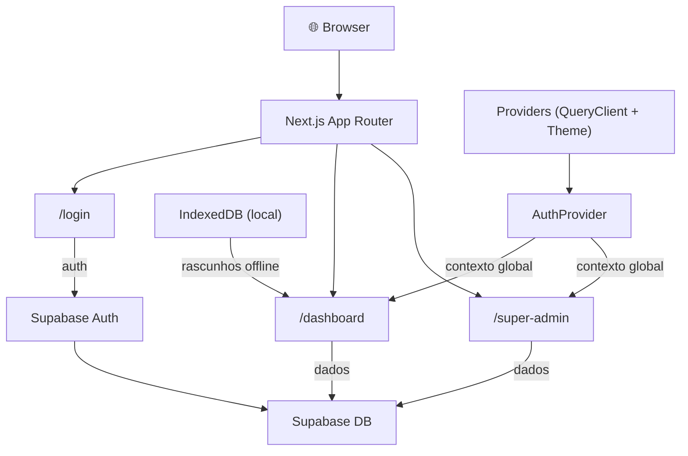
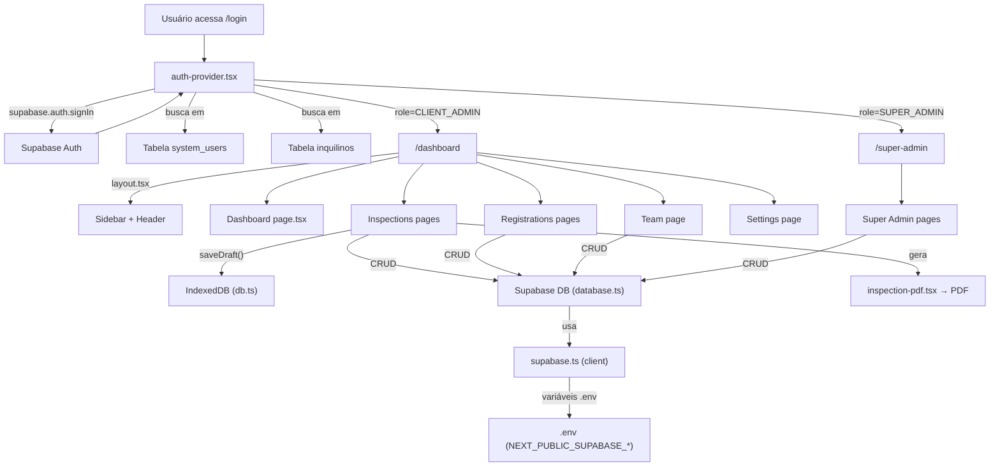

# 📋 Relatório de Estrutura do Projeto — Vistorify (ImobCheck)

> **Plataforma SaaS de Vistoria de Imóveis**
> Stack: Next.js 14 · TypeScript · Supabase · TailwindCSS · shadcn/ui

---

## 🗺️ Visão Geral da Arquitetura



O projeto é um **SaaS multi-tenant** onde:
- **Agências imobiliárias** (tenants) se cadastram e gerenciam vistorias
- **Super Admins** gerenciam as agências e planos
- **Inquilinos** fazem primeiro acesso e visualizam vistorias

---

## 📁 Estrutura de Diretórios Raiz

| Pasta / Arquivo | Descrição |
|---|---|
| `src/` | Todo o código-fonte da aplicação |
| `supabase/` | Scripts SQL de schema, seeds e migrations |
| `scripts/` | Scripts utilitários de suporte |
| `public/` | Imagens públicas estáticas (logos) |
| [.env](file:///c:/Users/vinic/OneDrive/Documentos/Alura/imobcheck/.env) | Variáveis de ambiente (chaves Supabase) |
| [package.json](file:///c:/Users/vinic/OneDrive/Documentos/Alura/imobcheck/package.json) | Dependências e scripts npm |
| [tailwind.config.js](file:///c:/Users/vinic/OneDrive/Documentos/Alura/imobcheck/tailwind.config.js) | Configuração do tema CSS |
| [tsconfig.json](file:///c:/Users/vinic/OneDrive/Documentos/Alura/imobcheck/tsconfig.json) | Configuração TypeScript |
| [next.config.mjs](file:///c:/Users/vinic/OneDrive/Documentos/Alura/imobcheck/next.config.mjs) | Configuração do Next.js |
| [supabase_schema.sql](file:///c:/Users/vinic/OneDrive/Documentos/Alura/imobcheck/supabase_schema.sql) | Schema principal do banco de dados |
| [supabase_migration.sql](file:///c:/Users/vinic/OneDrive/Documentos/Alura/imobcheck/supabase_migration.sql) | Migrações de banco de dados |

---

## 📁 `src/` — Código-Fonte Principal

```
src/
├── app/          ← Páginas (Next.js App Router)
├── components/   ← Componentes reutilizáveis
├── lib/          ← Utilitários e clientes de dados
├── hooks/        ← React Hooks customizados
└── types/        ← Interfaces TypeScript globais
```

---

## 📄 `src/app/` — Páginas da Aplicação

### `layout.tsx` — Layout Raiz
Envolve **toda** a aplicação. Configura:
- Fonte **Inter** do Google Fonts
- Metadados SEO (título: "Vistorify - Vistorias Residenciais Inteligentes")
- O componente `<Providers>` (contextos globais)
- O `<Toaster>` (notificações toast)

### `page.tsx` — Página Raiz `/`
Redirecionamento simples para `/login`.

### `globals.css` — Estilos Globais
Variáveis CSS de design system (cores, bordas, sombras) com suporte a **modo escuro**.

---

### 📁 `app/login/` — Página de Login (`/login`)

**`page.tsx`** (28KB) — Página de autenticação completa com **3 flows**:

| Flow | Descrição |
|---|---|
| **Login normal** | Email + senha via `useAuth().login()` |
| **Primeiro Acesso** | Inquilino insere email → verifica CNPJ → cria senha |
| **Esqueceu a senha** | Envio de email de recuperação via Supabase |

Conecta-se com: `AuthProvider` → `supabase.auth` → tabelas `system_users` e `inquilinos`.

---

### 📁 `app/dashboard/` — Área do Cliente (`/dashboard`)

Protegida por autenticação: apenas roles `CLIENT_ADMIN` e `INSPECTOR`.

**`layout.tsx`** — Layout do Dashboard com:
- **Sidebar colapsível** com ícones (Lucide React)
- Menu de navegação: Dashboard | Vistorias | Imóveis | Locadores | Inquilinos | Equipe | Meu Plano | Configurações
- Header com email do usuário, ThemeSwitcher e botão "Nova Vistoria"
- Footer da Vistorify
- Responsivo: modo mobile vs. desktop

**`page.tsx`** (18KB) — **Dashboard Principal** com:
- Métricas: total de vistorias, vistorias recentes, imóveis cadastrados
- Lista de vistorias recentes com status
- Cards de atalhos rápidos

#### 📁 `dashboard/inspections/` — Vistorias

**`page.tsx`** (35KB) — **Lista de Vistorias** com:
- Tabela de todas as vistorias com filtros (status, tipo, data)
- Ações: visualizar, exportar PDF, excluir
- Indicadores de progresso por ambiente

**`inspections/new/page.tsx`** (20KB) — **Nova Vistoria** (formulário multi-etapa):
1. Seleção de imóvel, inquilino e locador (com `quick-add-*` modais)
2. Definição de ambientes com base em templates (`presets.ts`)
3. Inspeção item a item com fotos e status
4. Leituras de medidores (luz/água/gás) e chaves
5. Término e geração de PDF

**`inspections/active-demo/`** e **`inspections/summary-demo/`** — Páginas de demonstração do fluxo de vistoria.

#### 📁 `dashboard/registrations/` — Cadastros

**`registrations/page.tsx`** — Listagem geral dos cadastros (hub de navegação).

**`registrations/properties/page.tsx`** (28KB) — **Imóveis**: CRUD completo com endereço (CEP, logradouro, bairro, etc.), integração com ViaCEP.

**`registrations/landlords/page.tsx`** (23KB) — **Locadores**: CRUD com CPF (com máscara) e dados de contato.

**`registrations/tenants/page.tsx`** (23KB) — **Inquilinos (Clientes)**: CRUD completo com CPF e telefone mascarados, cadastro com envio de notificações e flag `primeiro_acesso`.

#### 📁 `dashboard/team/` — Equipe

**`team/page.tsx`** (25KB) — Gerenciamento de membros da equipe da agência:
- Lista de `system_users` vinculados à `agency_id` do usuário logado
- Criação de novos membros (inspetores/admins)
- Edição e remoção

#### 📁 `dashboard/settings/` — Configurações

**`settings/page.tsx`** (17KB) — Configurações da conta da agência:
- Dados da agência (nome, CNPJ, endereço)
- Troca de senha
- Informações de plano atual

---

### 📁 `app/super-admin/` — Área do Super Admin (`/super-admin`)

Protegida exclusivamente para role `SUPER_ADMIN`.

**`layout.tsx`** — Layout do Super Admin com sidebar própria:
- Menu: Dashboard | Assinantes | Super Admins | Configurações | Planos

**`page.tsx`** (43KB) — **Dashboard Super Admin**: visão macro do sistema (total de agências, receita, planos ativos, etc.).

**`super-admin/plans/page.tsx`** (19KB) — **Gerenciamento de Planos**: CRUD de planos de assinatura (limites de usuários, vistorias, armazenamento, preços).

**`super-admin/tenants/page.tsx`** — **Gestão de Agências Assinantes**: listagem e gerenciamento de todas as agências clientes.

**`super-admin/users/page.tsx`** — **Super Admins**: listagem e gestão dos usuários com role `SUPER_ADMIN`.

**`super-admin/settings/page.tsx`** — **Configurações globais** do sistema.

---

### 📁 `app/actions/` — Server Actions

**`auth-actions.ts`** (9KB) — Actions de autenticação executadas no servidor:
- `signIn`, `signOut`
- Criação/atualização de senhas

**`settings-actions.ts`** (2.8KB) — Actions de atualização de configurações (dados da agência).

---

## 📁 `src/components/` — Componentes Reutilizáveis

### 📁 `components/auth/`
**`auth-provider.tsx`** — **Contexto de Autenticação Global** (React Context).
- Gerencia estado do usuário logado (`user`, `isLoading`)
- Implementa: `login`, `logout`, `verifyFirstAccess`, `verifyCnpj`, `createPassword`, `resetPassword`
- Busca dados em `system_users` (equipe da agência) ou `inquilinos` (clientes)
- Redireciona pós-login: `SUPER_ADMIN` → `/super-admin`, outros → `/dashboard`

### 📁 `components/providers/`
**`tenant-provider.tsx`** — Contexto para dados da agência atual (agency_id, nome, plano).

### `components/providers.tsx` — Orquestrador de Contextos
Empilha todos os providers na ordem correta:
```
QueryClientProvider
  └── ThemeProvider
        └── TenantProvider
              └── AuthProvider
                    └── {children}
```

### `components/theme-provider.tsx` e `theme-switcher.tsx`
Suporte a **light/dark mode** via `next-themes`. O `ThemeSwitcher` é o botão que aparece no header.

### 📁 `components/ui/` — Design System (shadcn/ui)

26 componentes de UI base. Os principais:

| Componente | Uso |
|---|---|
| `sidebar.tsx` | Sidebar colapsível dos layouts |
| `button.tsx` | Botões com variantes |
| `dialog.tsx` | Modais e diálogos |
| `table.tsx` | Tabelas de dados |
| `toast.tsx` + `toaster.tsx` | Notificações |
| `select.tsx` + `searchable-select.tsx` | Dropdowns |
| `sheet.tsx` | Painéis laterais deslizantes |
| `tabs.tsx` | Abas de navegação |
| `card.tsx` | Cards de conteúdo |
| `input.tsx` + `label.tsx` | Formulários |
| `logo.tsx` | Logo da Vistorify |
| `badge.tsx` | Etiquetas de status |
| `progress.tsx` | Barras de progresso |

### 📁 `components/vistorify/` — Componentes de Domínio

| Arquivo | Descrição |
|---|---|
| `IssueListItem.tsx` | Item de problema/defeito em uma vistoria |
| `MetricCard.tsx` | Card de métrica para o dashboard |
| `RegistrationsNav.tsx` | Navegação entre abas de cadastros |
| `TenantFacetCard.tsx` | Card detalhado de um inquilino |

### 📁 `components/inspection/`
**`inspection-pdf.tsx`** (15KB) — Componente de geração de **PDF de vistoria** usando `@react-pdf/renderer`. Renderiza o laudo completo com ambientes, fotos, itens, assinaturas e medidores.

### 📁 `components/inspections/` — Quick-Adds (modais inline)

Modais para cadastra entidades rapidamente **durante** o preenchimento de uma vistoria:

| Arquivo | Descrição |
|---|---|
| `quick-add-client.tsx` | Adicionar inquilino rapidamente |
| `quick-add-landlord.tsx` | Adicionar locador rapidamente |
| `quick-add-property.tsx` | Adicionar imóvel rapidamente (com CEP) |

---

## 📁 `src/lib/` — Utilitários e Acesso a Dados

| Arquivo | Descrição |
|---|---|
| `supabase.ts` | Cliente Supabase (client-side, anon key) |
| `supabaseClient.ts` | Instância alternativa do cliente Supabase |
| `db.ts` | **IndexedDB local** para rascunhos de vistoria offline |
| `database.ts` | Funções de acesso ao banco de dados Supabase (CRUD) |
| `presets.ts` | Templates de ambientes e itens de vistoria (Sala, Quarto, etc.) |
| `export-utils.ts` | Utilitários de exportação (ZIP de fotos, etc.) |
| `mock-data.ts` | Dados mock para desenvolvimento |
| `utils.ts` | Funções auxiliares (`cn()` para classnames) |

### `lib/db.ts` — IndexedDB (Armazenamento Local)
Persiste **rascunhos de vistoria** no navegador enquanto o inspetor trabalha offline:
- `saveDraft()` / `getDraft()` / `deleteDraft()` 
- `saveBlob()` / `getBlob()` — fotos salvas localmente
- `purgeOldDrafts()` — limpeza automática após 30 dias

### `lib/database/inquilinos.ts`
Módulo específico para operações CRUD na tabela `inquilinos` do Supabase.

---

## 📁 `src/hooks/` — React Hooks Customizados

| Arquivo | Descrição |
|---|---|
| `use-mobile.ts` | Detecta se a tela é mobile (`window.innerWidth < 768`) |
| `use-toast.ts` | Hook para disparar notificações toast (estado + actions) |

---

## 📁 `src/types/` — Tipos TypeScript Globais

**`index.ts`** — Interface central de todos os modelos de dados:

| Tipo | Descrição |
|---|---|
| `User` | Usuário do sistema (id, email, name, role) |
| `Tenant` | Agência assinante (nome, plano, CNPJ, status) |
| `Property` | Imóvel vistoriado (endereço completo) |
| `Landlord` | Locador (CPF, contato) |
| `Client` | Inquilino (CPF, `primeiro_acesso`) |
| `Inspection` | Vistoria (tipo, ambientes, medidores, assinaturas) |
| `InspectionEnvironment` | Ambiente da vistoria (sala, quarto…) |
| `InspectionItem` | Item inspecionado (status ok/not_ok/pending, fotos) |
| `SubscriptionPlan` | Plano SaaS (limites de usuários, vistorias, storage) |
| `UserRole` | `SUPER_ADMIN` \| `CLIENT_ADMIN` \| `INSPECTOR` |

---

## 📁 `supabase/` — Banco de Dados

Scripts SQL que definem e populam o banco no **Supabase (PostgreSQL)**:

| Arquivo | Descrição |
|---|---|
| `schema.sql` | Schema completo (tabelas, constraints, RLS policies) |
| `seed-presets.sql` | Dados iniciais de templates de vistoria |
| `seed-super-admin.sql` | Criação do usuário Super Admin inicial |
| `grants.sql` | Permissões de acesso por role |
| `disable-rls.sql` | Desabilita RLS para debugging |
| `create-plans.sql` | Criação dos planos de assinatura |
| `master-schema-fix.sql` | Correções cumulativas do schema |
| `update-agencies.sql` / `update-subscriptions.sql` | Patches de campos |

### Tabelas Principais do Banco

```
agencies          ← Agências assinantes (tenants)
system_users      ← Usuários da plataforma (staff das agências)
inquilinos        ← Clientes/inquilinos das agências
properties        ← Imóveis cadastrados
landlords         ← Locadores cadastrados
inspections       ← Vistorias realizadas
plans             ← Planos de assinatura
subscriptions     ← Assinaturas das agências
```

---

## 📁 `public/` — Assets Estáticos

Logos da Vistorify em variações:
- `vistorify-logo-dark.png` / `vistorify-logo-light.png` — versões light/dark
- `vistorify_logo_white.png` — logo branco
- `vistorify_logo_login.jpg` — logo da tela de login

---

## 📁 `scripts/`

**`seed-presets.mjs`** — Script Node.js para popular o banco com os presets de ambientes de vistoria (execução pontual via `node scripts/seed-presets.mjs`).

---

## 🔗 Como Tudo se Conecta



---

## 🧩 Diagrama de Componentes por Página

| Página | Componentes Usados |
|---|---|
| `/login` | `AuthProvider`, `Button`, `Input`, `Logo` |
| `/dashboard` | `Layout`, `Sidebar`, `MetricCard`, `ThemeSwitcher` |
| `/dashboard/inspections` | `Table`, `Badge`, `Sheet`, `inspection-pdf` |
| `/dashboard/inspections/new` | `Dialog`, `Select`, `quick-add-*`, `db.ts`, `presets.ts` |
| `/dashboard/registrations/*` | `Table`, `Dialog`, `Input`, `RegistrationsNav` |
| `/dashboard/team` | `Table`, `Dialog`, `Button` |
| `/dashboard/settings` | `Card`, `Input`, `Button`, `settings-actions.ts` |
| `/super-admin` | `SuperAdminLayout`, `MetricCard` |
| `/super-admin/plans` | `Table`, `Dialog`, `Card` |

---

## 📦 Dependências Principais

| Biblioteca | Papel |
|---|---|
| `next` 14 | Framework (App Router, Server Actions) |
| `@supabase/supabase-js` | Cliente do banco de dados e auth |
| `@tanstack/react-query` | Cache e sincronização de dados do servidor |
| `@react-pdf/renderer` | Geração de PDFs de vistoria |
| `react-hook-form` + `zod` | Validação de formulários |
| `lucide-react` | Ícones |
| `next-themes` | Light/dark mode |
| `idb` | Wrapper do IndexedDB (rascunhos offline) |
| `@brazilian-utils/brazilian-utils` | Validação de CPF/CNPJ |
| `shadcn` + `@radix-ui/*` | Componentes de UI acessíveis |
| `tailwindcss` | Utilitários de estilo |
| `jszip` + `file-saver` | Exportação de arquivos (ZIP de fotos) |
